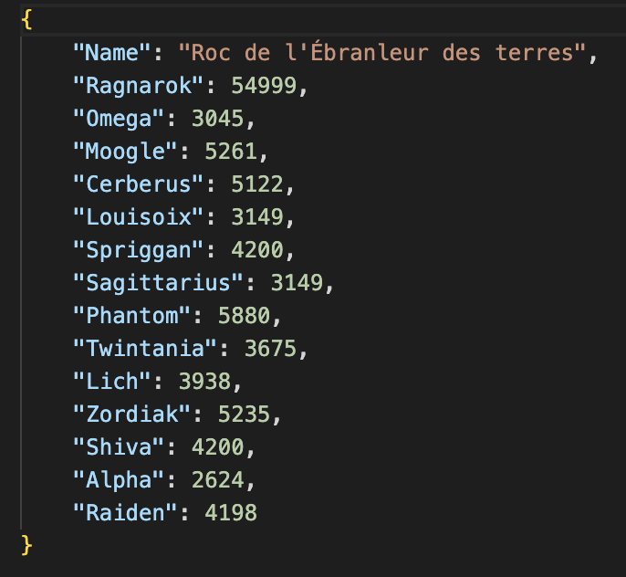

<br/>
<p align="center">
  <a href="https://github.com/jungso-gb/FF-Marketboard-Analysis">
    
  </a>

  <h3 align="center">FFXIV Marketboard Analysis</h3>

  <p align="center">
    To Analysize the marketboard and be a good trader 👌 
    <br/>
    <br/>
    <a href="https://github.com/jungso-gb/FF-Marketboard-Analysis"><strong>Explore the docs »</strong></a>
    <br/>
    <br/>
    <a href="https://github.com/jungso-gb/FF-Marketboard-Analysis/issues">Report Bug</a>
    .
    <a href="https://github.com/jungso-gb/FF-Marketboard-Analysis/issues">Request Feature</a>
  </p>
</p>

    

## Table Of Contents

* [About the Project](#about-the-project)
* [Getting Started](#getting-started)
  * [Prerequisites](#prerequisites)
  * [Installation](#installation)
* [Usage](#usage)
* [Contributing](#contributing)
* [License](#license)
* [Authors](#authors)
* [Acknowledgements](#acknowledgements)

## About The Project



This is a new script in Python to analyze the Marketboard in one click !

The features:

* Have current taxes in your world
* Compare all prices in yours servers of your country
* Different modes to determine which items is interresting
* Categories features
 
This script is currently working in progress.


## Getting Started

This is an example of how you may give instructions on setting up your project locally.
To get a local copy up and running follow these simple example steps.

### Prerequisites

This is an example of how to list things you need to use the software and how to install them.

* npm

```sh
npm install npm@latest -g
```

### Installation

1. Clone the repo

```sh
git clone https://github.com/jungso-gb/FF-Marketboard-Analysis.git
```

3. Install NPM packages

```sh
npm install
```

4. Run the script

## Usage

You have a section "modify variables" to put that you want.
Start script by python3.11

## Contributing

Contributions are what make the open source community such an amazing place to be learn, inspire, and create. Any contributions you make are **greatly appreciated**.
* If you have suggestions for adding or removing projects, feel free to [open an issue](https://github.com/jungso-gb/FF-Marketboard-Analysis/issues/new) to discuss it, or directly create a pull request after you edit the *README.md* file with necessary changes.
* Please make sure you check your spelling and grammar.
* Create individual PR for each suggestion.
* Please also read through the [Code Of Conduct](https://github.com/jungso-gb/FF-Marketboard-Analysis/blob/main/CODE_OF_CONDUCT.md) before posting your first idea as well.

### Creating A Pull Request

1. Fork the Project
2. Create your Feature Branch (`git checkout -b feature/AmazingFeature`)
3. Commit your Changes (`git commit -m 'Add some AmazingFeature'`)
4. Push to the Branch (`git push origin feature/AmazingFeature`)
5. Open a Pull Request

## License

Distributed under the MIT License. See [LICENSE](https://github.com/jungso-gb/FF-Marketboard-Analysis/blob/main/LICENSE.md) for more information.

## Authors

* [GREGOIRE Brice](https://github.com/jungso-gb/) 

## Acknowledgements

* [GREGOIRE Brice](https://github.com/jungso-gb/)
